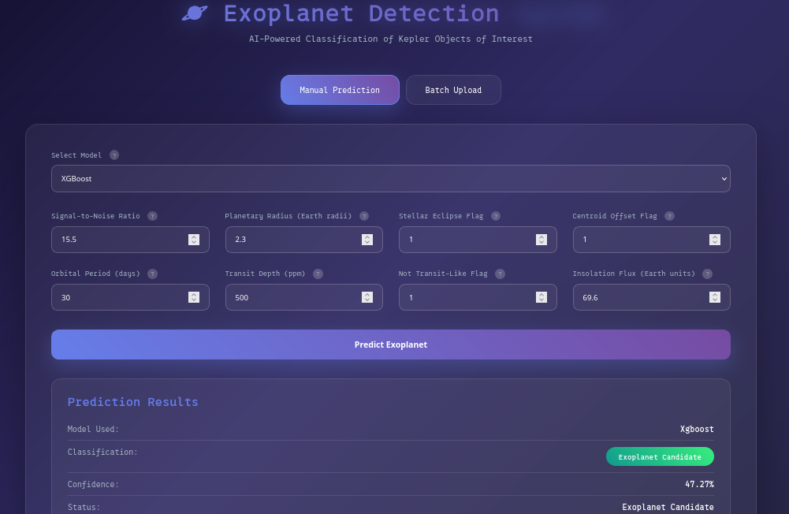
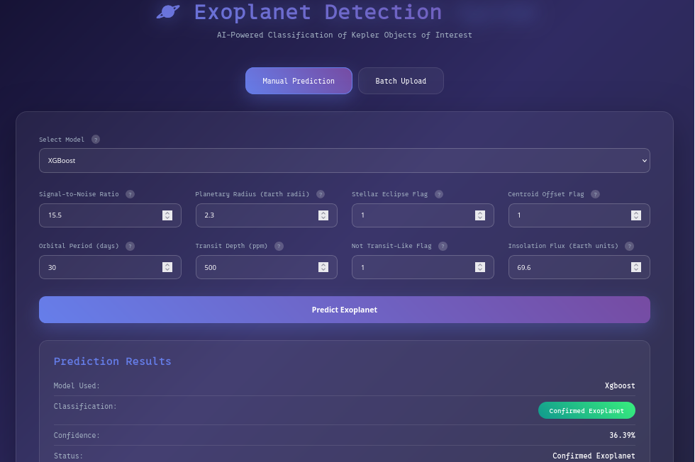

+++
title = "Reproducibility"
date = 2025-10-15
+++

<h2 align="center"> Reproducibility: In Machine Learning Applications </h1>

toc()

### Background
I recently participated in the NASA space apps challenge, an annual global hackathon which brings together developers, designers and storytellers for a 2-day event. Every year, NASA has a list of challenges that participants may chose from. This year, my team decided to tackle challenge #2 (A World Away: Hunting for Exoplanets with AI).

### Task

Project Description:

> Data from several different space-based exoplanet surveying missions have enabled discovery of thousands of new planets outside our solar system, but most of these exoplanets were identified manually. With advances in artificial intelligence and machine learning (AI/ML), it is possible to automatically analyze large sets of data collected by these missions to identify exoplanets. Your challenge is to create an AI/ML model that is trained on one or more of the open-source exoplanet datasets offered by NASA and that can analyze new data to accurately identify exoplanets. (Astrophysics Division)

<strong>tldr;</strong> We were to build a machine learning model that can accurately identify exoplanets, classifying them as "Confirmed Exoplanet", "Exoplanet Candidate" or "False Positive"

We were quick to develop and deploy a machine learning prediction pipeline using XGBoost and a Random Forest model on [huggingface](https://huggingface.co/spaces/pacman2223/exo-standalone) with a FastAPI backend which was linked to a html frontend. However, we noticed some issues with the prediction.

### Output:

First run            |  Second run
:-------------------------:|:-------------------------:
  |  
<!--   -->


> There's something wrong here.
> Notice that the two images are different even though the same values were used across

The model is not consistent in it's result. This suggests something went wrong in it's training procedure.


### Reproducibility

Reproducibility in machine learning is the ability to produce the same results by using the same code, data and settings as the original experiment. In our case, when we run both predictions we should either obtain "Confirmed Exoplanet" or "Exoplanet Candidate" for the two and not varying results.


### Tracing the error

```py
# XGB Classifier
xgb_selected_mi = XGBClassifier(use_label_encoder=False, eval_metric='mlogloss')
xgb_selected_mi.fit(X_train_selected_scaled_mi, y_train)
y_pred_xgb_selected_mi = xgb_selected_mi.predict(X_test_selected_scaled_mi)


# RandomForest Classifer
rf = RandomForestClassifier()
rf.fit(X_train_scaled, y_train)
y_pred_rf = rf.predict(X_test_scaled)

```

> All the classifiers used lacked the `random_state` argument. 

### More on RandomState()

In machine learning, the rule of thumb is to always set a `seed`. A seed is any number that you use to ensure reproducibility of results.

Many machine learning algorithms involve some form of randomness, such as splitting data into training and test sets. When the `seed` or `random_state` is not set, these algorithms will produce different results each time the code is executed.

Here is a link to a [Kaggle](https://www.kaggle.com/discussions/general/422466) discussion that explains this in more detail.


### What should have been done

```py
#SEED should have been set from the start to prevent repetition

SEED = 42

np.random.state(SEED) # this makes models that use numpy automatically use the seed set (in case you forget to set random state)

# Train, test split
X_train, X_test, y_train, y_test = train_test_split(X, y, test_size=0.2, random_state=SEED) # set to ensure consistent splits

# XGB Classifier
xgb_selected_mi = XGBClassifier(use_label_encoder=False, eval_metric='mlogloss', random_state=SEED)
xgb_selected_mi.fit(X_train, y_train)
y_pred_xgb_selected_mi = xgb_selected_mi.predict(X_test)


# RandomForest Classifer
rf = RandomForestClassifier(random_state=SEED)
rf.fit(X_train, y_train)
y_pred_rf = rf.predict(X_test)
```

> Even though `np.random.seed(SEED)` will work, `random_state` should also be stated since the numpy function does not work with all algorithms


### Results:

First run            |  Second run
:-------------------------:|:-------------------------:
  |  


> As you can see, results were now consistent

[Test the model out](https://huggingface.co/spaces/pacman2223/exo-standalone)

Thank you for reading!
